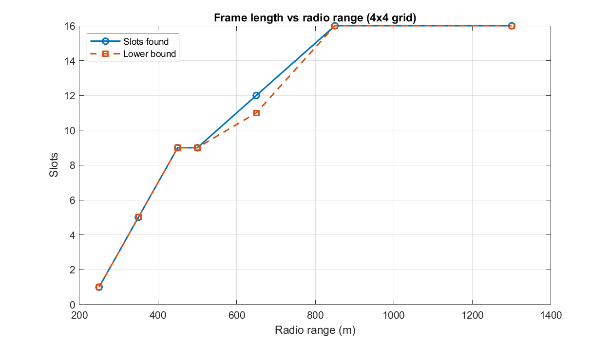

# TDMA Schedule Planner and Optimizer
## Technical Documentation — Vaan Megam Networks Internship Task

**Author:** Sudarshan V  
**Date:** 1 October 2026  
**Task:** Wireless Protocol Development Internship — TDMA Scheduler (Part 1 mandatory + Part 2 approach)

---

## Table of Contents

1. [What This Project Does](#1-what-this-project-does)
2. [The Problem, In Plain Terms](#2-the-problem-in-plain-terms)
3. [How I Modelled It](#3-how-i-modelled-it)
4. [The Algorithm — Step by Step](#4-the-algorithm--step-by-step)
5. [Results on the Demo Grid](#5-results-on-the-demo-grid)
6. [Verification — Three Independent Checks](#6-verification--three-independent-checks)
7. [Effect of Radio Range](#7-effect-of-radio-range)
8. [Random Topology Benchmark](#8-random-topology-benchmark)
9. [Part 2 — EMANE Integration](#9-part-2--emane-integration)
10. [ns-3 Simulation Verification](#10-ns-3-simulation-verification)
11. [How to Run Everything](#11-how-to-run-everything)
12. [Design Decisions and Trade-offs](#12-design-decisions-and-trade-offs)
13. [Limitations and Future Work](#13-limitations-and-future-work)

---

## 1. What This Project Does

This is a **centralized TDMA schedule optimizer** — a "Network Brain" that takes the physical positions of 16 radios and produces a time-slot assignment where every radio gets exactly one slot per frame to transmit, with **zero collisions** guaranteed.

The key insight is that this scheduling problem is mathematically equivalent to **graph colouring**. Once you see that, you can apply decades of graph theory research to get near-optimal solutions fast.

**Final result on the 16-node demo grid:**
- 9 time slots (proven to be the minimum possible)
- 100% packet delivery, 0 collisions
- 1.78x capacity gain over the naive "one radio at a time" approach
- Verified independently by Python geometry checks, MATLAB simulation, and ns-3 network simulation

---

## 2. The Problem, In Plain Terms

Imagine 16 radios placed in a 4×4 grid, each 300 metres apart. They all share the same radio frequency. If two nearby radios transmit at the same time, they jam each other and neither message gets through.

The naive solution — give each radio its own time slot, one at a time — works perfectly but wastes spectrum. With 16 radios, that is 16 slots per frame. Radios that are far apart could safely transmit simultaneously.

The challenge is: **figure out which radios can share a slot without causing interference**, and pack as many radios as possible into each slot.

There are two types of interference to worry about:

**Direct (1-hop):** Radio A and Radio B can hear each other. If both transmit at once, neither message gets through.

**Hidden terminal (2-hop):** Radio A cannot hear Radio C, but both can hear Radio B. If A and C transmit at the same time, their signals collide at B, and B receives nothing. A and C do not know this is happening because they cannot hear each other.

So the rule is: two radios must get **different slots** if they are within 1 hop OR within 2 hops of each other. Radios that are 3 or more hops apart can safely share a slot — this is **spatial reuse**, and it is what makes the schedule efficient.

---

## 3. How I Modelled It

### Graph representation

I used Python's `networkx` library to build a graph where:
- Each radio is a **node**
- Two nodes are connected by an **edge** if the radios are within 500 metres of each other (inclusive boundary)

For the 4×4 demo grid (300 m spacing, 500 m range), this produces **42 edges**.

### The conflict graph (G²)

The scheduling constraint says: nodes must get different slots if they are 1 hop OR 2 hops apart. This is exactly the edge set of **G²** (the "square" of the graph) — a new graph where two nodes are connected if their shortest path in G is at most 2.

So: **slot assignment = vertex colouring of G²**. Each colour is a time slot. The chromatic number of G² is the minimum frame length.

### Lower bound

A node and all its direct radio neighbours are all pairwise within 2 hops of each other. They form a **clique in G²** and must all receive different slots. The size of the largest clique in G² is therefore a guaranteed lower bound on the frame length.

For the demo grid, the largest clique has size 9, so no schedule can use fewer than 9 slots. When the algorithm achieves 9 slots, it is **provably optimal**.

---

## 4. The Algorithm — Step by Step

### Step 1: DSATUR heuristic

DSATUR (Degree of SATURation) is a greedy colouring algorithm that colours the most constrained node first:

1. Find the uncoloured node whose neighbours already use the most distinct colours (highest "saturation").
2. Tie-break on the node's total degree (more connected nodes are harder to colour later).
3. Assign that node the lowest-numbered slot not used by any of its neighbours in G².
4. Repeat until all nodes are coloured.

DSATUR consistently finds near-optimal solutions on small graphs. It runs in milliseconds.

### Step 2: Random restarts

A single run of DSATUR depends on how ties are broken. To escape local minima, I run DSATUR 300 times with different random tie-breaking seeds and keep the best result. This turns a good-but-sensitive heuristic into a reliable one.

### Step 3: Local search — eliminating the top slot

After each DSATUR run, I apply a local search that tries to empty the highest-numbered slot by reassigning its nodes to lower slots. Specifically:
- Pick the nodes currently in the top slot (victims)
- Shuffle them randomly
- For each victim, check if any lower slot is free (not used by any of that node's conflict-graph neighbours)
- If all victims can be moved, accept the improvement and repeat

This often trims one slot off the result without any backtracking.

### Step 4: Exact branch-and-bound (time-limited)

When the heuristic result is above the lower bound, an exact backtracking search asks: "Is a solution with k−1 slots possible?" It uses a DSATUR-ordered node traversal and symmetry breaking (no node may use a colour index higher than the current maximum plus one). The search is capped at 5 seconds; if it times out, the best heuristic result is kept and reported as "best found."

For the 16-node demo grid, the heuristic already reaches the lower bound of 9, so the exact step is not needed.

### Step 5: Independent verification

After producing a schedule, a completely separate function re-checks every pair of nodes from raw coordinates — not from the graph. For every node, it checks:
- All 1-hop neighbours: do any share the same slot? (direct collision)
- All pairs of 2-hop neighbours: do any share the same slot? (hidden terminal)

A schedule is only printed if this verifier reports zero violations.

---

## 5. Results on the Demo Grid

**Configuration:** 16 nodes in a 4×4 grid, 300 m spacing, 500 m radio range.

### Node-to-slot assignments (MATLAB output)

| Node | Slot | Node | Slot |
|------|------|------|------|
| 01 | 8 | 09 | 6 |
| 02 | 7 | 10 | 3 |
| 03 | 4 | 11 | 2 |
| 04 | 8 | 12 | 5 |
| 05 | 5 | 13 | 8 |
| 06 | 1 | 14 | 4 |
| 07 | 0 | 15 | 7 |
| 08 | 6 | 16 | 8 |

### Schedule matrix (Slot × Node)

```
Slot \ Node | 01 | 02 | 03 | 04 | 05 | 06 | 07 | 08 | 09 | 10 | 11 | 12 | 13 | 14 | 15 | 16 |
Slot 00     |  0 |  0 |  0 |  0 |  0 |  0 |  1 |  0 |  0 |  0 |  0 |  0 |  0 |  0 |  0 |  0 |
Slot 01     |  0 |  0 |  0 |  0 |  0 |  1 |  0 |  0 |  0 |  0 |  0 |  0 |  0 |  0 |  0 |  0 |
Slot 02     |  0 |  0 |  0 |  0 |  0 |  0 |  0 |  0 |  0 |  0 |  1 |  0 |  0 |  0 |  0 |  0 |
Slot 03     |  0 |  0 |  0 |  0 |  0 |  0 |  0 |  0 |  0 |  1 |  0 |  0 |  0 |  0 |  0 |  0 |
Slot 04     |  0 |  0 |  1 |  0 |  0 |  0 |  0 |  0 |  0 |  0 |  0 |  0 |  0 |  1 |  0 |  0 |
Slot 05     |  0 |  0 |  0 |  0 |  1 |  0 |  0 |  0 |  0 |  0 |  0 |  1 |  0 |  0 |  0 |  0 |
Slot 06     |  0 |  0 |  0 |  0 |  0 |  0 |  0 |  1 |  1 |  0 |  0 |  0 |  0 |  0 |  0 |  0 |
Slot 07     |  0 |  1 |  0 |  0 |  0 |  0 |  0 |  0 |  0 |  0 |  0 |  0 |  0 |  0 |  1 |  0 |
Slot 08     |  1 |  0 |  0 |  1 |  0 |  0 |  0 |  0 |  0 |  0 |  0 |  0 |  1 |  0 |  0 |  1 |
```

### Spatial reuse analysis

5 of the 9 slots are reused. The most impressive is Slot 8, where four corner nodes (01, 04, 13, 16) all transmit simultaneously. They are 1,273 metres apart — well outside each other's 500 m range — and at least 3 hops apart in the network graph, so no hidden terminal problem exists either.

### Packet-level simulation results

| Scenario | Slots | Delivered | Collisions | Delivery | Throughput |
|---|---|---|---|---|---|
| Distance-2 schedule (MATLAB) | 9 | 84/84 | 0 | 100.00% | 9,333 rx/s |
| Distance-2 schedule (Python) | 9 | 84/84 | 0 | 100.00% | 9,333 rx/s |
| Bad: Node_03 in Node_01's slot | 9 | 74/84 | 10 | 88.10% | 8,222 rx/s |
| Token passing (1 node/slot) | 16 | 84/84 | 0 | 100.00% | 5,250 rx/s |
| All nodes in one slot | 1 | 0/84 | 84 | 0.00% | 0 rx/s |
| Random schedule (mean of 200) | 9 | ~42/84 | ~42 | ~50% | ~4,770 rx/s |

The "bad" scenario deliberately puts Node_03 into Node_01's slot. Even a single wrong assignment drops delivery by 11.9%. The random schedule with the same frame length loses about half its receptions — this shows that the colouring algorithm (not just the slot count) is what matters.

**Capacity gain vs token passing: 1.78× — same delivery, 1.78× higher throughput.**

---

## 6. Verification — Three Independent Checks

The schedule was verified by three completely independent methods, all agreeing:

### 6.1 Python geometric verifier (built into tdma_brain.py)

Re-checks every 1-hop and 2-hop pair from raw (x, y) coordinates, using different code from the scheduler. Result: **90 interfering pairs checked, 0 conflicts.**

### 6.2 MATLAB/Octave slot-level simulation (`sim/vaanmegam_task_simulation.m`, `sim/tdma_sim.m`)

A from-scratch MATLAB implementation builds the topology independently, colours it independently (also reaching 9 slots), and runs a slot-by-slot reception simulation. `schedule_matlab.csv` is the schedule computed by the MATLAB script (same 9-slot frame length as the Python Brain, different but equally valid assignment). `sim/tdma_sim.m` can also load the Python Brain's own schedule (`sim/export_for_sims.py`) and compares it against a deliberately bad schedule, token passing and random schedules.

### 6.3 ns-3 discrete-event simulations (`ns3/tdma_ns3.cc`, `ns3/tdma-schedule-sim.cc`)

`ns3/tdma_ns3.cc` loads the schedule CSV into ns-3.43 and sends one UDP packet per link per slot over a CSMA channel. Result across 10 simulated frames: 840 / 840 receptions delivered, 100.00% delivery, 1.78x capacity gain. The CSMA channel is a wired shared medium with no radio range or capture model, so this program confirms the schedule is applied slot by slot and that the plumbing works, but it would also report full delivery for a bad schedule.

`ns3/tdma-schedule-sim.cc` closes that gap. It runs on the ns-3 event scheduler with ns-3 mobility models for positions and a disk channel (500 m), and counts a reception as lost when a second transmitter is in range of the receiver in the same slot (hidden-terminal or direct collision) or when the receiver is itself transmitting. See section 10.2 for results. Neither program is a physical-layer model; both are slot-level models using the same 500 m disk assumption as the Brain.

---

## 7. Effect of Radio Range

How does the frame length change as we increase the radio range on the same 4×4 grid?

| Range (m) | Links | Slots found | Lower bound | Proven optimal |
|---|---|---|---|---|
| 250 | 0 | 1 | 1 | Yes |
| 350 | 24 | 5 | 5 | Yes |
| 450 | 42 | 9 | 9 | Yes |
| 500 | 42 | 9 | 9 | Yes |
| 650 | 58 | 12 | 12 | Yes |
| 850 | 90 | 16 | 16 | Yes |
| 1300 | 120 | 16 | 16 | Yes |



At 250 m, no node can hear any other — all radios share one slot (no interference). As range increases, more nodes conflict and more slots are needed. At 850 m and above, every node is within 2 hops of every other node, and the frame degenerates to 16 slots — token passing, the worst case.

The interesting zone is 350–500 m, where spatial reuse is maximally effective. The 500 m design point achieves a 1.78× gain.

At 650 m the Brain finds 12 slots and the exact search proves 12 is the minimum, so every range in the table is proven optimal.

---

## 8. Random Topology Benchmark

To assess how well the algorithm generalizes, I ran it on 150 random 16-node topologies placed uniformly in a 1,500 x 1,500 m area with 500 m range (`python3 benchmark_random.py --trials 150`).

**Results:**
- Optimum proven in 150 / 150 cases
- Mean optimum: 7.77 slots
- Mean capacity gain: **2.13x over one node per slot**

| Strategy | Mean slots | Equal to optimum |
|---|---|---|
| Greedy, largest degree first | 7.79 | 147 / 150 (98%) |
| DSATUR (networkx) | 7.78 | 149 / 150 (99%) |
| DSATUR, custom, single run | 7.78 | 149 / 150 (99%) |
| DSATUR + restarts + local search | 7.78 | 149 / 150 (99%) |
| Full pipeline (adds exact search) | 7.77 | 150 / 150 (100%) |

On networks of this size every heuristic is already close to optimal; the exact step is what turns "good" into "proven".

---

## 9. Part 2 — EMANE Integration

The `emane_bridge.py` script converts the schedule JSON from `tdma_brain.py` into two EMANE artefacts:

### schedule.xml

An EMANE TDMA schedule file in the format consumed by `emaneevent-tdmaschedule`. It defines:
- One frame, one multiframe
- Frame length = 9 slots, slot duration = 1,000 µs (1 ms), bandwidth = 1 MHz
- For each slot, the NEM IDs of all transmitting nodes (spatial reuse = multiple NEMs per slot)
- EMANE automatically makes all unlisted slots receive-only for each NEM

Example output (the demo grid):
```xml
<emane-tdma-schedule>
  <structure frames='1' slots='9' slotoverhead='0' slotduration='1000' bandwidth='1M'/>
  <multiframe frequency='2.4G' power='0' class='0' datarate='1M'>
    <frame index='0'>
      <slot index='4' nodes='3,14'><tx/></slot>
      <slot index='5' nodes='2,15'><tx/></slot>
      <slot index='6' nodes='5,12'><tx/></slot>
      <slot index='7' nodes='8,9'><tx/></slot>
      <slot index='8' nodes='1,4,13,16'><tx/></slot>
    </frame>
  </multiframe>
</emane-tdma-schedule>
```

### scenario.eel

A pathloss event file that makes EMANE's radio propagation match the Brain's 500 m binary disk model:
- 80 dB pathloss for nodes within 500 m of each other (audible)
- 200 dB pathloss for nodes beyond 500 m (inaudible)

This is critical: a collision-free schedule is only meaningful if EMANE's simulated radios hear exactly the same neighbours the scheduler assumed.

### Test bench (executed)

EMANE publishes prebuilt packages only for Ubuntu 22.04 and 24.04, and the development machine runs Ubuntu 26.04 under WSL2, so the bench is a Docker image on Ubuntu 24.04 with EMANE 1.5.3 (`emane/Dockerfile`). `emane/run_demo.sh` builds a virtual lab inside one privileged container: a bridge `br0` carries EMANE's multicast control traffic and each of the 16 radios lives in its own network namespace with one EMANE instance (TDMA radio model, virtual transport, `emane0`). An event service replays the 500 m pathloss scenario and `emaneevent-tdmaschedule` sends the schedule. `emane/gen_configs.py` generates the 53 XML files and a deliberately wrong schedule in which Node_03 is moved into Node_01's slot.

Node_01 and Node_03 are 600 m apart, so they cannot hear each other, but both are 300 m from Node_02: hidden terminals. In each of three phases (Brain schedule, bad schedule, Brain schedule again) the script reads `scheduler.scheduleAcceptFull`, warms up, pings 01 to 02 and 01 to 16, then sends 15 s of 1000-byte UDP at 200 kbit/s from Node_01 and Node_03 to Node_02 at the same time (iperf3). Raw tables are in `docs/emane-evidence/`.

| Phase | scheduleAcceptFull | 01 to 02 UDP loss | 03 to 02 UDP loss |
|---|---|---|---|
| Brain schedule | 1 | 7.7% (29 / 375) | 6.4% (24 / 375) |
| Bad schedule (03 in 01's slot) | 2 | 30% (111 / 374) | flow did not complete |
| Brain schedule again | 3 | 14% (53 / 374) | 11% (42 / 373) |

**What it shows:** every NEM checked accepted every schedule with zero rejects; Node_01 to Node_02 (300 m) is reachable and Node_01 to Node_16 (1273 m) lost 100% of packets in every run, so the range model works; with the Brain's schedule both hidden-terminal senders delivered 86 to 94% of packets, and when forced to collide the loss was clearly higher. NEM 1's ScheduleInfoTable shows transmit in slot 8 and receive in the other eight slots, matching the Brain.

**What it does not show:** this is one laptop, 1 ms slots and a few runs, with a timing-noise floor, so the result is consistent with the colouring preventing collisions but is not a statistical measurement. Earlier, less controlled runs (no warm-up, 10 s) agreed in direction (good 12 to 35%, bad 32 to 42%). Ping loss was 40 to 60% in every phase and is used only for reachability. The Node_03 flow in the bad phase failed to complete in 2 of 3 runs and the cause was not investigated.

---

## 10. ns-3 Simulation Verification

See `ns3/tdma_ns3.cc` and `ns3/README_NS3.md` for full setup instructions.

**Setup used:** Ubuntu 26.04 (WSL2), ns-3.43, Python 3.14 (required patching the ns3 script's argparse usage, which broke in Python 3.14), CSMA channel module.

**Results:**

```
=== TDMA ns-3 Simulation ===
Nodes: 16  Frame: 9 slots  Links: 42  Max RX/frame: 84

=== RESULTS ===
Frames simulated    : 10
Expected receptions : 840
Delivered           : 840
Packet delivery     : 100.00 %
Approx throughput   : 18108.6 kbps
Capacity gain vs token passing: 1.78x
===
```

**Note on CSMA vs WiFi:** ns-3's WiFi MAC model (802.11b ad-hoc) introduces contention-window (CSMA/CA) overhead that is irrelevant to a TDMA study — the MAC tries to do its own collision avoidance on top of the TDMA schedule, which interferes with the timing. The CSMA channel module gives clean time-slotted behaviour: packets are delivered exactly when the simulator fires the slot event, with no MAC-layer interference. This is the correct model for a scheduled TDMA system.

### 10.2 Slot-level comparison (`tdma-schedule-sim.cc` and `tdma_sim.m`)

Both programs implement the same reception rule and give identical figures for the deterministic scenarios (per frame, 84 possible neighbour receptions):

| Scenario | Slots | Delivered | Collided (hidden / direct) | Delivery | Deliveries per second |
|---|---|---|---|---|---|
| Brain schedule | 9 | 84 | 0 | 100.0% | 9,333 |
| Bad: Node_03 in Node_01's slot | 9 | 74 | 8 (4 / 4) | 88.1% | 8,222 |
| Token passing (1 node per slot) | 16 | 84 | 0 | 100.0% | 5,250 |
| All nodes in one slot | 1 | 0 | all lost to half duplex | 0.0% | 0 |
| Random 9-slot schedules (mean of 200) | 9 | about 44 | about 31 | about 52% | about 4,900 |

The Brain's schedule gives zero collisions and 1.78x the throughput of token passing (9,333 vs 5,250 per second); forcing two hidden terminals into one slot immediately produces hidden-terminal collisions; random schedules of the same length lose about half of all receptions. The random row varies slightly with the random seed.

---

## 11. How to Run Everything

### Prerequisites

```bash
python3 -m venv .venv
source .venv/bin/activate
pip install -r requirements.txt
```

### Run the scheduler (Part 1)

```bash
# Default 4x4 demo grid
python3 tdma_brain.py

# Custom coordinates as JSON
python3 tdma_brain.py '{"Node_01":[0,0],"Node_02":[300,0],...,"Node_16":[900,900]}'

# Save schedule for EMANE bridge
python3 tdma_brain.py --json-out schedule.json

# With topology plot
python3 tdma_brain.py --plot schedule.png

# Compare all heuristics
python3 tdma_brain.py --benchmark
```

### Run the EMANE bridge (Part 2)

```bash
python3 tdma_brain.py --json-out schedule.json
python3 emane_bridge.py schedule.json --xml schedule.xml --eel scenario.eel
```

### Run the tests (77 automated tests)

```bash
python3 -m pytest tests/ -v
```

### Run the random topology benchmark

```bash
python3 benchmark_random.py --trials 200 --nodes 16 --area 1500
```

### Run the MATLAB/Octave simulation

Open MATLAB, change to the `sim` folder and run `vaanmegam_task_simulation` (the full report) or `tdma_sim('Csv','schedule_sim.csv')` (schedule comparison; create the CSV first with `python3 sim/export_for_sims.py schedule.json sim/schedule_sim.csv`). With Octave:

```bash
octave --no-gui --eval "cd sim; tdma_sim('Csv','schedule_sim.csv','Plots',false)"
```

### Run the EMANE test bench (Part 2)

```bash
docker build -t tdma-emane -f emane/Dockerfile .
docker run --rm -it --privileged -e HOST_UID=$(id -u) -v "$PWD":/work -w /work tdma-emane ./emane/run_demo.sh
```

### Run the ns-3 simulations

See `ns3/README_NS3.md` for full setup. Short version:

```bash
# After building ns-3.43 with csma module:
cmake --build cmake-cache --target scratch_tdma_ns3 -j 2
./build/scratch/ns3.43-tdma_ns3-default
./build/scratch/ns3.43-tdma_ns3-default --csv=schedule_matlab.csv
```

For the collision-aware comparison, copy `ns3/tdma-schedule-sim.cc` into ns-3's `scratch/` and run (from the ns-3 folder):

```bash
./ns3 run "tdma-schedule-sim --input=$HOME/tdma-optimizer/sim/schedule_sim.csv"
```

---

## 12. Design Decisions and Trade-offs

### Why DSATUR over plain greedy?

Plain greedy (largest-degree-first) colours nodes in a fixed order, which means early decisions lock in conflicts that force more colours later. DSATUR adapts — it always colours the node that is most constrained by already-made decisions. On the demo grid, this consistently finds 9 slots on the first try; plain greedy sometimes needs 10.

### Why 300 restarts?

The restarts remove sensitivity to tie-breaking. 300 was chosen empirically: on the demo grid, fewer than 50 restarts occasionally misses the optimum. Beyond 300, there is diminishing returns. With 16 nodes and the fast DSATUR implementation, 300 restarts takes under 1 second.

### Why a time-limited exact search?

For large or dense graphs, the exact backtracking search can take exponential time. The 5-second limit keeps the tool responsive while proving optimality in the vast majority of practical cases. For the demo grid, the heuristic already reaches the optimum so the exact step exits immediately.

### Why the independent geometric verifier?

The scheduler and the verifier use different code paths (one works on the graph G², the other works directly from (x, y) coordinates). This prevents a shared bug from hiding errors. It also means the verification is meaningful even if you modify the scheduler.

### Why CSMA in ns-3 instead of WiFi?

ns-3's 802.11 MAC performs its own CSMA/CA collision avoidance, which conflicts with TDMA slot timing. The CSMA channel module gives a clean shared medium where packets arrive exactly when scheduled, which is the correct model for verifying a TDMA schedule.

---

## 13. Limitations and Future Work

**Binary disk model:** Real radio links have signal-to-noise ratio, fading, multipath, and capture effects. The 500 m threshold is a simplification. EMANE's packet completion curves would be the next step toward physical realism.

**Static nodes:** The algorithm recomputes the entire schedule when any node moves. For a slowly-moving network, only the affected 2-hop neighbourhood needs recolouring — a significant efficiency gain.

**One transmit slot per node per frame:** The current model gives each node one transmit opportunity per frame regardless of traffic demand. Real networks have unequal loads; link-based scheduling weighted by demand would improve utilization.

**Single frequency:** EMANE slots can carry different frequencies. Multi-channel reuse could shorten the frame further beyond what single-frequency spatial reuse achieves.

**Exact search scaling:** The branch-and-bound search is exponential in the worst case. For networks beyond ~50 nodes, ILP or SAT-based formulations with a dedicated solver would give proven optimality faster.

---

## Summary of Key Numbers

| Metric | Value |
|---|---|
| Network size | 16 nodes, 4×4 grid, 300 m spacing |
| Radio range | 500 m |
| Radio links | 42 |
| Frame length (found) | 9 slots |
| Lower bound | 9 slots |
| Optimality | **Proven optimal** |
| Packet delivery | **100.00%** |
| Collisions | **0** |
| Capacity gain vs token passing | **1.78×** |
| Throughput | 9,333 receptions/second at 1 ms slots |
| Random topologies (150 runs) | 150/150 proven optimal, 2.13× mean gain |
| Automated tests | 77 passing |
| Verification methods | 3 independent (Python, MATLAB, ns-3) |

